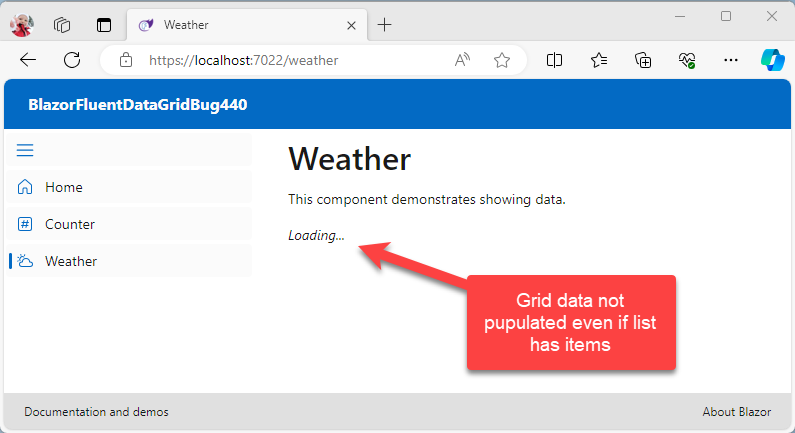
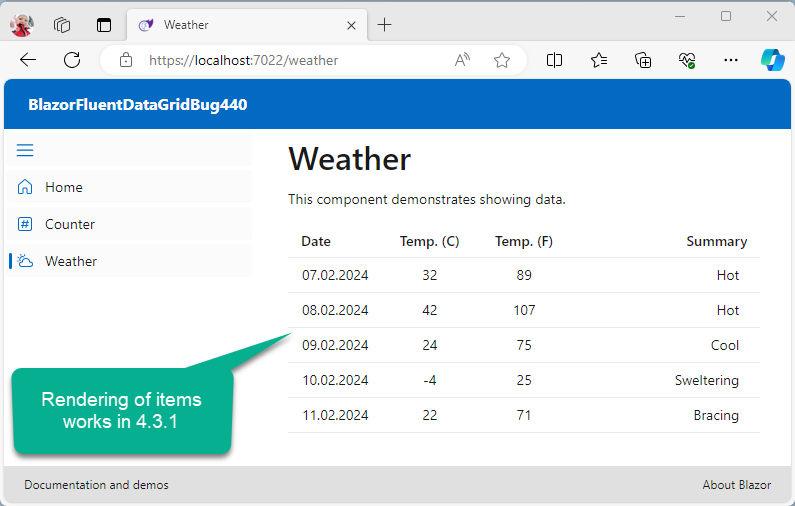

# BUG rendering items in FluentDataGrid v 4.4.0

```xml
<Project Sdk="Microsoft.NET.Sdk.Web">

  <PropertyGroup>
    <TargetFramework>net8.0</TargetFramework>
    <Nullable>enable</Nullable>
    <ImplicitUsings>enable</ImplicitUsings>
  </PropertyGroup>

  <ItemGroup>
    <ProjectReference Include="..\BlazorFluentDataGridBug440.Client\BlazorFluentDataGridBug440.Client.csproj" />
    <PackageReference Include="Microsoft.AspNetCore.Components.WebAssembly.Server" Version="8.*-*" />
  </ItemGroup>
  <ItemGroup>

	  <!-- 4.4.0 Does not populate/render FluentDataGrid -->
	  <PackageReference Include="Microsoft.FluentUI.AspNetCore.Components" Version="4.*-* " />       <!-- Effectively using version 4.4.0 -->
	  <PackageReference Include="Microsoft.FluentUI.AspNetCore.Components.Icons" Version="4.*-* " /> <!-- Effectively using version 4.4.0 -->

	  <!-- Working version 4.3.1-->
	  <!--
	  <PackageReference Include="Microsoft.FluentUI.AspNetCore.Components" Version="4.3.1" />
	  <PackageReference Include="Microsoft.FluentUI.AspNetCore.Components.Icons" Version="4.3.1" />
	  -->
  </ItemGroup>
</Project>

```

## Regression error introduced in v 4.4.0



## Works in v 4.3.1


